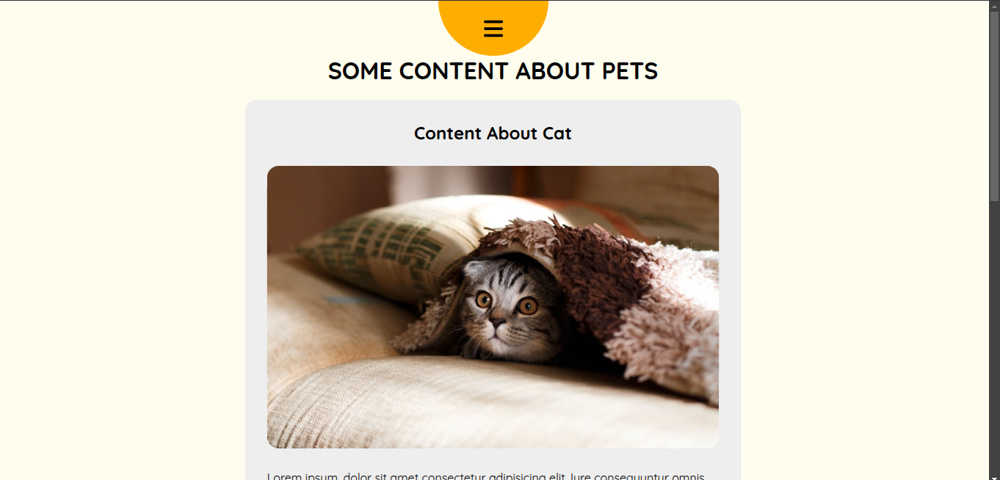

Divider Nav menu
created using HTML , CSS and JS

In this app when you click on the nav button
it will split the content to half (left and right)
and it will show the nav menu in the gap .

Example:

