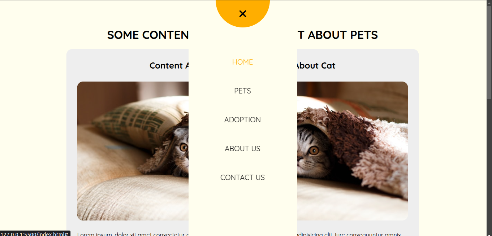

# 🚪 Divider Nav Menu

An animated navigation menu built with **HTML**, **CSS**, and **JavaScript**.  
Clicking the nav button splits the screen content into two halves (left and right), revealing the nav menu in the center.

---

## 🌐 Live Demo

[🔗 View Demo](https://hassanhajizadeh-dividerNav.netlify.app)

---

## ✨ Features

-   Smooth content-splitting animation
-   Central navigation menu reveal
-   Responsive layout
-   Clean HTML/CSS structure with JavaScript interaction

---

## 🛠 Built With

-   **HTML**
-   **CSS**
-   **JavaScript**

---

## 📸 Screenshots

  


---

## 📂 How to Use

1. Clone the repo:
    ```bash
    git clone https://github.com/hassanhajizadeh/dividerNav.git
    ```
2. Open the project folder in **VS Code** (or your preferred editor).
3. Use an extension like **Live Server** to run `index.html` locally:
    - Right-click on `index.html` and choose **"Open with Live Server"**

---

## 📄 License

This project is licensed under the [MIT License](LICENSE).
